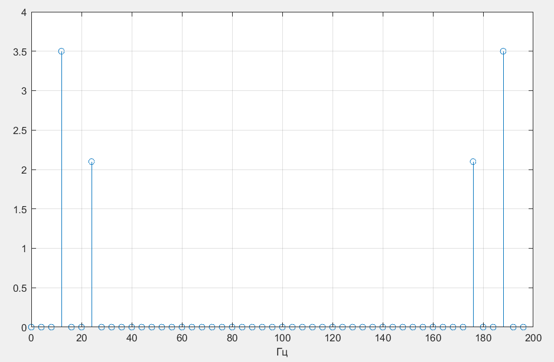
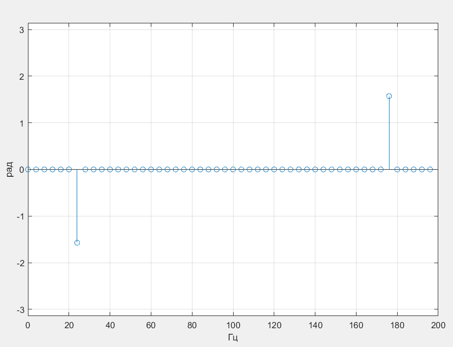

# Оглавление
- [Задание](#Задание)
- [Теория](#Теория)
- [Технические решения](#Технические-решения)
- [API](#API)
- [Примеры работы](#Примеры-работы)
- [Ответ на задание](#Ответ-на-задание)
 ____
 
 # Задание
- Написать на С++ класс быстрого прямого и обратного преобразования Фурье комплексных значений с возможной длиной преобразования кратной 2, 3, 5.
- Запустить для случайных комплексных входных данных сначала прямое, а потом обратное преобразование Фурье.
- Сравнить ошибку между входными и выходными данными.
____
 # Теория
 ## В данном репозитории реализовано
 1. ### Дискретное преобразование Фурье
 2. ### Дискретное преобразование Фурье с разделением на множители
    
   <br/>
   
При разделении преобразование фурье с длиной преобразования $N$ на две части $N = N_1 * N_2$ асимптотическая сложность уменьшается с $O(N^2)$ до $O(N_1N_2)$
 <p align="center"> пример для $N = 1000$ при разбиении $N_1 = 20, N_2 = 50$ </p>
 <p align="center"> $N^2=10e6$ и $20*50=1000$ (разница в три порядка) </p>
 <br/>

 3. ### Дискретное преобразование Фурье с рекурсивным разделением на множители (Вариант алгоритма Кули-Тьюки)<br/>
   Длина преобразования рекурсивно разбивается на подмножители. Каждое разбиние уменьшает количество необходимых инструкций в итоге<br/>
   Каждый вариант имеет прямой и обратный вариант преобразования
   
   ___
# Технические решения
- Реализован класс __FFT__ в пространстве имён __YADRO_TEST__
- Все методы класса статические, вместо реализации шаблона singleton
- В шаблонах я использовал if constexpr, так что для сборки нужен минимум c++17
- В отдельном заголовчном файле устанавливается флаг определяющий точность чисел используемых в проекте (float | double)
- Так как для реализуемых преобразований Фурье необходимы проходы по строкам/столбцам матриц, вместо использования матриц в пространстве имён реализован класс __matrix_vector_mapper__ позволяющий проходить по линейным массивам как по строкам/столбцам матрицы
- методы класса __FFT__ являются шаблонами принимающими enum __dft_direction__, который определяет необходимое преобразование (прямое/обратное)
- В во всех методах с разделением на множители используется метод __dft_mapped__ преобразующий строки/столбцы матрицы. Каждое преобразование строки/столбца выполняется ассинхронно с помощью __std::async__ и __std::future__, что может ускорить работу (__std::async__ не всегда выполняет работу в отдельном потоке)

# USER API
## dft
```
//Делает простое прямое/обратное дискретное преобразование Фурье
FFT::dft<dft_direction>(const std::vector<complex_t> poinst, std::vector<complex_t>& spectrum)
```
## fft_subdivided
```
//Делает дискретное преобразование фурье с разбиением на множители один из которых N1  
//Бросит исключение, если длина преобразования не делится на N1
FFT::fft_subdivided<dft_direction>(const std::vector<complex_t> poinst, std::vector<complex_t>& spectrum, size_t N1)
```
## fft_recursive
```
//Делает рекурсивное разбиение на множители (2, 3, 4, 5, 7, 8, 16, 32)
FFT::fft_recursive<dft_direction>(const std::vector<complex_t> poinst, std::vector<complex_t>& spectrum, size_t N1)
```
## ifft_recursive
```
//Обратное рекурсивное преобразование
FFT::ifft_recursive<dft_direction>(const std::vector<complex_t> poinst, std::vector<complex_t>& spectrum, size_t N1)
```

# Примеры работы

Задавшись, например, максимальной интересующей нас частотой и шагом спектра по частоте, считаем количество необходимых отсчетов.<br>
Также сгенерируем отсчёты суммы синуса и косинуса частоты которых кратны шагу спектра для наглядности.

```
const number_t fmax = 100;
const number_t fs = fmax * 2;
const number_t Ts = 1.0 / fs;	

const number_t df = 4;
const size_t pts_cnt = std::ceil(1.0 / (df * Ts));
	
const number_t dw = 2 * pi * df;

const number_t f = df * 3;
const number_t w = 2 * pi * f;

for (int i = 0; i < pts_cnt; i++) {
 points[i] = 3.5 * cos_f(w * Ts * i) + 2.1 * sin_f(w * 2 * Ts * i);
}
```

Получим спектр одним из методов. Также нормируем спектр. Запишем отсчёты в файл. Построим графики.

```
using namespace YADRO_TEST;
using dft_dir = FFT::dft_direction;

std::vector<complex_t> points(pts_cnt);
std::vector<complex_t> FFTspectrum(points.size());
1)FFT::dft<dft_dir::forward>(points, FFTspectrum);
2)FFT::fft_subdivided<dft_dir::forward>(points, FFTspectrum, pts_cnt / 5);
3)FFT::fft_recursive(points, FFTspectrum);
```

Видим отсчёты с заданной амплитудой на заданных частотах симметричные относительно центральной частоты. Фазовый спектр анти-симметричен.



# Ответ на задание
Зададим случайный комплексный сигнал. Произведём над ним прямое и обратное преобразование Фурье. Затем возьмём модуль от разности изначальных и полученных чисел. Получим ошибку, возьмём максимальную для оценки. Смысл имеет говорить об ошибке относительно максимальной амплитуды сигнала.

## Были получены такие значения для точности double для различных методов:

| dft error | fft_subdivide error | fft error |
|-----------------------|-------------------------|------------------------|
0.00000000000283216462% | 0.00000000000283216462% | 0.00000000000105821330%


## Были получены такие значения для точности float для различных методов:

| dft error | fft_subdivide error | fft error |
|-----------------------|-------------------------|------------------------|
0.00186314189340919256% | 0.00186314189340919256% | 0.00063831266015768051%

Ошибки незначительные, у float на 8 порядков хуже чем у double.
Код для этой задачи находится в [main.cpp](./src/main.cpp)
